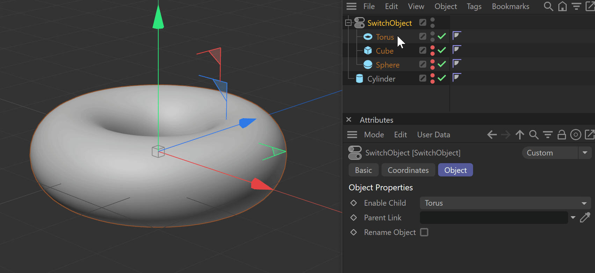

# SwitchObject 2.0.1
Sometimes you want to create different versions or configurations of an object or scene. Like a room with different sets of curtains, a truck with different trailers or just alternative light setups for a scene (e.g. day, evening, night).

Of course, you could do this with XPresso, creating User Data entries for all your options, connecting lots of nodes to check for the parameters and the visibility values of all lots of hierarchy branches... and if you added another curtain to your room, or another trailer to your truck, you would have to worry about wiring the new objects, too, and updating all the User Data entries.

_SwitchObject_ makes this really easy for you: No Xpresso, no User Data, no takes, just straight forward switching of object groups.

_SwitchObject 2_ is a Python rewrite of my classic C++ plugin [SwitchObject](https://github.com/fwilleke80/SwitchObject). _SwitchObject 2_ does things in a cleaner way, the code is more compact, and it's platform independent.

## Installation
Unpack the ZIP archive, and copy the contained folder to `/Maxon/Cinema 4D/plugins`. Then (re)start Cinema 4D.

## Usage
<figure style="align: left; margin: 0 0 0 0; display: inline-block;" >
    
    <figcaption style="text-align: center; font-size: 0.8em;">SwitchObject2 in use</figcaption>
</figure>

### Parent Link
If you leave this link box empty, _SwitchObject_ will switch between its own child objects. Simply use _SwitchObject_ as a parent for a group of objects, and you're ready to go.

If you link an object here, _SwitchObject_ will switch between that linked object's children. That way, you can have your _SwitchObjects_ clearly laid out at the top of your scene hierarchy, and have it work on groups of objects that are buried deep in your scene hierarchy.

### Enable Child
Any objects available for switching will appear in this dropdown. Select one of them, and it will be set visible for editor and rendering display. The other objects in the group will be switched off.

If "Parent Link" is empty, the names of _SwitchObject_'s children will be listed here. If anything is linked in "Parent Link", the linked object's children will be listed here.

### Rename Object
If this option is active, _SwitchObject_ will be automatically renamed according to the currently active object in the group.

## Credits
Written by Frank Willeke  
[www.frankwilleke.de](https://www.frankwilleke.de)  
Released as open source under GPL3 license.